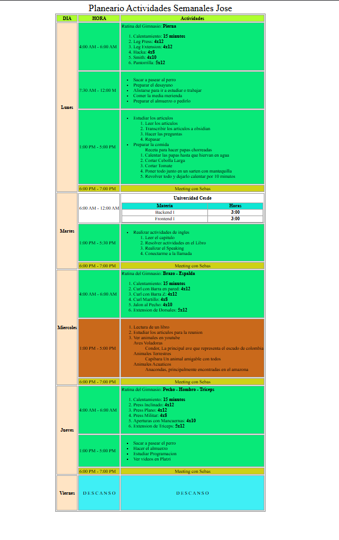

# 🗓️ Planificador Semanal de Actividades – Jose

Este proyecto muestra un **planificador semanal en HTML**, donde se detallan las actividades diarias con sus horarios, rutinas de gimnasio, estudio y reuniones.  
La tabla está estructurada semánticamente y cuenta con mejoras básicas de **accesibilidad (A11Y)** para usuarios con lectores de pantalla.

## 📋 Características
- Estructura con `<table>` y secciones `<thead>`, `<tbody>` y `<caption>`.
- Uso de `scope`, `id` y `headers` para asociar encabezados y celdas.
- Elementos semánticos como `<strong>`, `<ol>`, `<ul>`, `<dl>` y `<time>`.
- Colores diferenciados para facilitar la lectura visual.
- Centrado automático con CSS (`margin: 0 auto;`).
- Mini-tabla anidada para mostrar materias y horas (Universidad Cesde).

## IMAGEN
